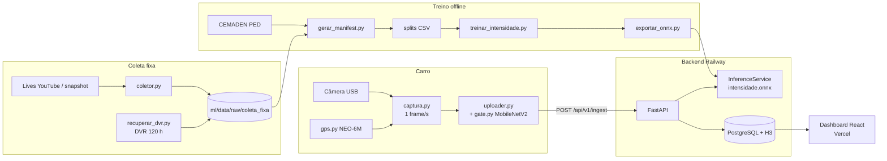
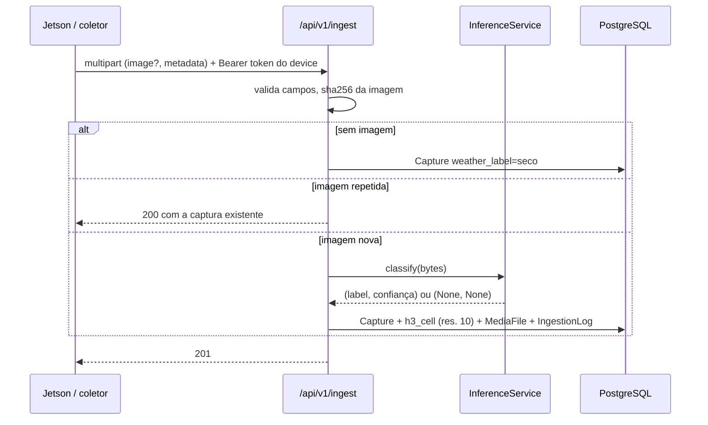

# Codebase Map — CityRain

> Gerado pelo Cartographer em 2026-10-08T21:34:44Z. Estado atual em `docs/COMO-CONTINUAR.md`;
> plano em andamento em `docs/specs/spec-camera-fixa.md`.

## Visão geral



## Estrutura

```
CityRain/
├── backend/            FastAPI + SQLAlchemy async + Alembic (Python 3.11)
│   ├── app/api/v1/     media.py (ingest), captures.py, stats.py, devices.py
│   ├── app/services/   media_service (ingest), inference_service (ONNX), capture_service, geo_service, device_service
│   ├── app/models/     device, capture, media_file, ingestion_log
│   ├── app/core/       config (Settings), database, security (token do device, admin key)
│   ├── app/inference/modelos/intensidade.onnx   modelo de produção (v3)
│   ├── alembic/versions/  0001 → 0002 → 0003 (ids escritos à mão; próxima = 0004)
│   └── tests/          testes unitários, sem banco
├── frontend/           React 19 + Vite + Tailwind + react-leaflet + h3-js + recharts (JSX)
│   └── src/{pages,components,hooks,api,lib}
├── ml/
│   ├── src/cityrain_ml/   evaluation/metricas.py (CLASSES), data/intensidade.py, models/fabrica.py, training/intensidade.py, data/sintetico.py
│   ├── scripts/captura/   código da Jetson (Python 3.6)
│   ├── scripts/coleta_fixa/  coletor.py, recuperar_dvr.py, importar_celular.py
│   ├── scripts/rotulagem/gerar_manifest.py   frame → classe pelo pluviômetro
│   ├── scripts/estacoes/  baixar_cemaden_ped.py, distancia.py, normalizadores
│   ├── scripts/dataset/   montar_splits.py, adicionar_lives.py
│   ├── scripts/treino/    treinar_intensidade.py, exportar_onnx.py, quantizar.py, treinar_gate.py
│   ├── scripts/avaliacao/ intervalos_confianca, gradcam, baseline_fisico, ensemble_hibrido
│   ├── configs/           YAML de cada experimento, rotulagem, splits, coleta
│   ├── data/manifests/    manifests de rótulo (versionados); demais pastas de data/ são gitignored
│   └── tests/
├── docs/               specs/, resultados-experimentos.md, COMO-CONTINUAR.md, roteiro-demo-defesa.md
└── .github/workflows/ci.yml   ml (pytest, sem torch) · backend (pytest) · frontend (lint + build)
```

## Módulos

### Backend

| Arquivo | Papel |
|---|---|
| `app/api/v1/media.py` | `POST /api/v1/ingest` (multipart: `image` opcional + `metadata` JSON com `captured_at`, `latitude`, `longitude`, `source_type`) |
| `app/services/media_service.py` | Valida metadados à mão, deduplica por sha256 da imagem, chama `inference_service.classify` (linha ~145), grava Capture, arquivo em disco e IngestionLog |
| `app/services/inference_service.py` | Singleton; carrega o ONNX e lê `classes`, `altura`, `largura`, `media`, `desvio` do `metadata_props`; traduz `moderada` → `moderado`; sem modelo devolve `(None, None)` |
| `app/core/security.py` | `verificar_api_key` (SHA-256 do Bearer contra `devices.api_key_hash`), `verificar_admin_key` |
| `app/services/capture_service.py` | listagem com filtros e `_sem_demo()`; heatmap H3 |
| `app/models/capture.py` | `WEATHER_LABELS` = seco, garoa, moderado, forte; CHECK no banco (`IS NULL OR IN (...)`) |

Endpoints: `/health`, `/health/db`, `POST /api/v1/ingest`, `GET /api/v1/captures/` (`skip`, `limit≤200`,
`weather_label`, `from_date`, `to_date`, `device_id`, `excluir_demo`), `GET /api/v1/captures/{id}`,
`GET /api/v1/stats/geo` (`resolution≤10`, mesmos filtros), `POST|GET|DELETE /api/v1/devices/` (admin),
`GET /api/v1/devices/publico`.

### Frontend

Rotas: `/` (Landing), `/dashboard` (ao vivo, `MapaAoVivo` + `PainelAgora`), `/dispositivos`,
`/historico` (H3 + `SerieTemporal`). Hooks: `useLiveCaptures`, `useDevices`, `useResumoPublico`,
`useHistorico`. Classes e cores em `lib/categories.js` (`categoryFromLabel`: rótulo nulo = "Não medido").
Env: `VITE_API_URL`, `VITE_POLL_MS`. Sem framework de teste (só lint e build).

### ML

- **Classes:** `metricas.CLASSES = ("garoa","moderada","forte")`, global e fixa no código. `seco` é do gate.
- **Treino:** `treinar_intensidade.py <yaml> [--cv | --fold k|final | --avaliar ckpt]`. Seleção pela
  média do F1 por domínio (irCNN × próprio). Saída em `ml/runs/<nome>__<ts>/`.
- **Modelos:** `fabrica.construir(arquitetura, n_classes)` com `mobilenet_v3_large|small`,
  `efficientnet_b0`, `resnet18` (torchvision, 3 canais).
- **Avaliação:** `avaliar` espera as partições `val`, `test_real`, `test_ircnn`, `test_ordinal_2309`,
  `test_ordinal_youtube`.
- **Export:** `exportar_onnx.py` (opset 17, entrada `imagem` 1×3×H×W, saída `logits`, metadados de
  classes e normalização, paridade ≤ 1e-4).
- **Rotulagem:** `gerar_manifest.py --config <yaml>`; regras de raio 2 km, consenso a 5 km (≥ 3
  estações), zona morta de 15%, seco confirmado em ±60 min. Todo frame fica no manifest, com
  `motivo_exclusao` quando não rotula.

### Jetson (`ml/scripts/captura/`)

Serviços systemd: `citycam` (captura), `gps`, `uploader` (gate + POST), `sessao`, `botao-desliga`,
`wifi-watchdog`. Implantação por `implantar_jetson.sh verificar|implantar`. Python 3.6 (sem
dataclass, sem walrus).

## Fluxo de ingestão



## Convenções

- Comentários e docstrings em português; nomes em inglês no backend, português no ML.
- Commits `tipo: descrição` em português; branches `feat/`, `fix/`, `exp/`, `docs/`.
- Scripts de ML não são pacote: testes carregam por caminho com `importlib.util.spec_from_file_location`.
- Testes do ML no CI rodam sem torch (`pytest.importorskip("torch")` onde precisar).
- Cada experimento é um YAML em `ml/configs/`.

## Armadilhas

- Rótulo nulo significa "não medido", nunca "seco" (backend, migrações e frontend respeitam isso).
- `UPLOAD_DIR` é disco local; no Railway ele some a cada deploy se não houver volume.
- Deploy do Railway já travou; confirmar pela versão do `/openapi.json`.
- Backend quebra em Python 3.14 (SQLAlchemy 2.0.37): usar 3.11.
- Lat/lon das lives são aproximadas; conferir antes de rotular.
- O `uploader.py` ainda envia `weather_label="chuva"`, que o backend ignora.
- `README.md` e os princípios 1 e 2 do `CLAUDE.md` dizem que framework e arquitetura estão em
  aberto; a produção já usa PyTorch + MobileNetV3-Large exportado em ONNX.
- `.env.local` do frontend guarda credencial do Vercel (gitignored).

## Navegação

| Tarefa | Arquivos |
|---|---|
| Novo endpoint | `backend/app/api/v1/*.py`, `app/api/router.py`, `app/schemas/`, `app/services/` |
| Mudar o banco | `backend/app/models/`, nova migração `backend/alembic/versions/0004_*.py` |
| Trocar o modelo de produção | `exportar_onnx.py --saida backend/app/inference/modelos/...` |
| Nova câmera fixa | `ml/configs/coleta_fixa.yaml`, estações em `baixar_cemaden_ped.py` |
| Novo experimento | `ml/configs/treino_*.yaml`, `ml/src/cityrain_ml/` |
| Nova página | `frontend/src/pages/`, rota em `App.jsx`, hook em `src/hooks/` |
